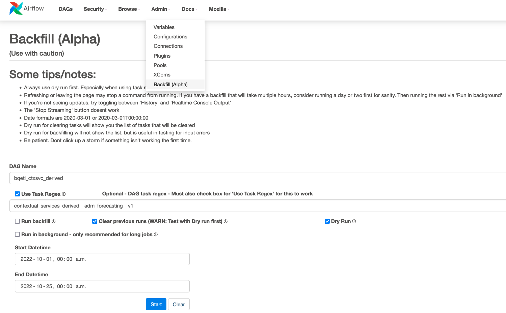

# Backfill `contextual_services_derived.adm_forecasting_v1`

See https://docs.google.com/document/d/1HHQn1pnLJ2IC2l5DvMG0pshHqIusptSp_8cOogzZ4LU/edit#heading=h.p64b1qfksx4w

The ADM forecasting dataset can be backfilled from the Airflow backfill UI. 
**When running a backfill be careful not to trigger a backfill of `contextual_services_derived.event_aggregates_v1` since this might lead to a loss of data.**

## [recommended] Backfill via Airflow

It is recommended to create a copy of the `contextual_services_derived.adm_forecasting_v1` dataset in a locked down sandbox environment. This way data can be recovered quickly in case the backfill goes wrong.
Deleted data can otherwise be recovered from snapshot tables within 7 days of when the deletion occured. So make sure to validate the data within 7 days of when the backfill completed.

To run a backfill via Airflow, Admin permissions are required.
Navigate to [Backfill (Alpha)](https://workflow.telemetry.mozilla.org/admin/backfill/).
Configure the backfill by entering the backfill time frames as well as DAG and task name. It is recommended to first test the backfill by selecting "Dry Run".
It is also recommended to initially only backfill a small time frame of data, check if the data looks correct and then run the entire backfill.



**Make sure to select the "Clear previous runs" checkbox.**

Hit start to trigger the backfill. Navigate to the [job list](https://workflow.telemetry.mozilla.org/job/list/) to check whether the backfill has been triggered and Airflow tasks have been scheduled to run.

## [alternative] Backfill via bqetl tooling

Instead of using the Airflow UI, it is also possible to trigger and run backfills locally using the [`bqetl`](https://github.com/mozilla/bigquery-etl#installing-bqetl) tooling. Since the `contextual_services_derived.adm_forecasting_v1` is confidential users do not have read or write permissions by default. For individuals that have permissions to view the data, a ticket needs to be opened with [SRE](https://mozilla-hub.atlassian.net/jira/software/c/projects/DSRE/issues/) to get write permissions.

It is recommended to create a copy of the `contextual_services_derived.adm_forecasting_v1` dataset in a locked down sandbox environment. This way data can be recovered quickly in case the backfill goes wrong.
Deleted data can otherwise be recovered from snapshot tables within 7 days of when the deletion occured. So make sure to validate the data within 7 days of when the backfill completed.

Authenticate to GCP via the command line: 

```
gcloud auth login --update-adc
gcloud config set project moz-fx-data-shared-prod
```

Run the backfill:

```
./bqetl query backfill contextual_services_derived.adm_forecasting_v1 --project_id=moz-fx-data-shared-prod -s 2022-10-01 -e 2022-10-25
```

